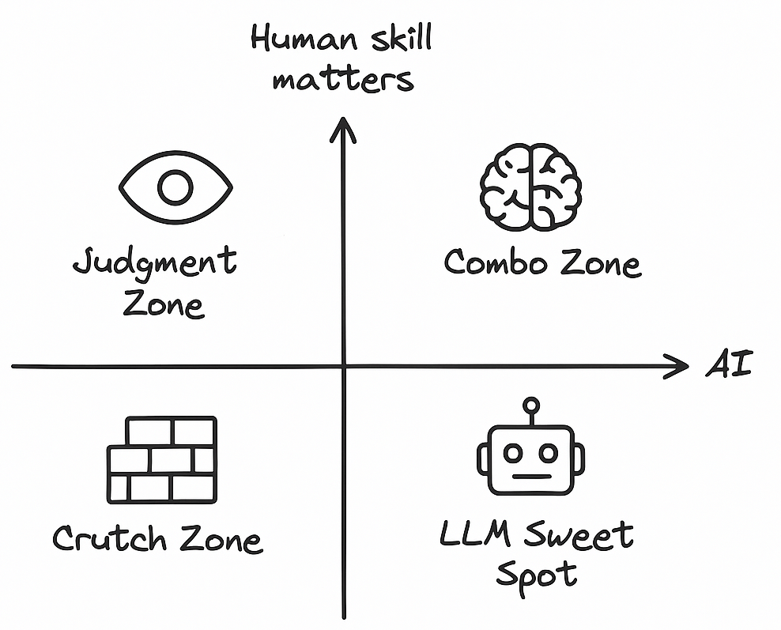

+++
title = "Scaling AI, with humans"
date = 2025-06-29T00:00:00+05:30
description = "AI is changing how we work. A mental model that helped me focus on what to focus on, what to let go, and what I need to grow into."
draft = false
+++

In my current role, I am responsible for leveraging AI on two major fronts:

- automate customer support issues with high quality  
- improve engineering productivity across SDLC

When automating Customer support, the tolerance for error is low. We can’t afford to mess things up. Every touchpoint matters - understanding their language, reducing back and forth, empathising with their frustrations. The customer usually reaches out after they’ve tried everything else. It’s not enough to be correct - the customer needs to feel that their concern is actually being addressed.

On the other side, when building for internal users, especially engineering, we have more room to experiment and can take some risks. Developers are usually more forgiving if something fails gracefully. We want to optimise for speed and cost - not just build some gimmicky features.

Now, whether it’s external or internal, I started thinking: maybe the issue isn’t just about whether AI is “good enough”. Maybe it’s about understanding where AI should lead, where humans still shine, and when the combo works best.

So I drew this quadrant to make sense of the landscape.

### Q3: 🧱 Crutch Zone  
*Low AI, low human involvement*

These are the problems that shouldn’t really need AI or humans. They only exist because of product gaps. This is where humans exist in the loop only because the product didn’t support something directly. Think rule engines, deterministic workflows, status updates. These problems don’t need AI. They need product fixes.

- "Check eligibility" - should be a button on the dashboard  
- "Why is my email not verified?" - validation logic  
- "Send alert if threshold breached" - runbook config

AI sometimes fills this gap, but it's a crutch. It shouldn’t have to.

### Q4: 🤖 The LLM Sweet Spot  
*High AI, minimal human involvement*

These are classic LLM-friendly problems. There is a clear set of data or logic. You can build RAG pipelines, plug into tools, and trust the answer most of the time.

- "Why is my refund taking so long?"  
- "I am unable to understand the documentation"  
- "What does this dashboard metric mean?"

The AI gets it right often enough but sometimes it can afford to do small mistakes. These are low-risk, high-reward. Here are some more examples that can do well for improving dev experience:

- Auto-generating PR descriptions based on code diffs  
- Writing quick integration tests from function signatures  
- Creating GitHub issues or documentation stubs from internal Slack threads  
- Parsing CI/CD logs and summarizing what went wrong

The key is: the problem has known structure, AI doesn’t need much context, and mistakes are cheap to fix.

### Q1: 🧠 The Combo Zone  
*High AI, high human involvement*

This is the quadrant where AI and humans amplify each other. The combo has a compounding effect. AI does the grunt work, human makes the final call. With the right tools, a smart human can 10x their impact:

- A support agent becomes capable of resolving deeper technical issues  
- A dev can focus on design decisions and edge cases by offloading boilerplate and tests  
- A fresher can jump into fixing complex production issues

In many ways, LLMs feel like that one super-enthu junior engineer - smart and fast, but needs direction. They can draft, summarize, connect dots, and suggest next steps but could sometimes make mistakes. When paired with experienced humans, the combo is unbeatable, else they can drift easily.

### Q2: 👀 The Judgment Zone  
*High human judgment, low AI reliability*

This quadrant is counterintuitive. You’d think everything eventually moves towards AI, right? But there are still cases where humans can outperform AI - not because the task is complex, but because the context or emotion isn’t obvious.

- A customer has asked a simple question but is frustrated because there are other tickets which are still open  
- A dispute needs context across teams, people, and old decisions  
- A hotfix needs coordination and judgment under pressure

Even if AI can give the right answer, it might escalate things further. The issue isn’t what is said, but how and when it’s said.

### The hard truth

Most problems feel like they should sit in the 1st, 3rd or the 4th quadrant - but they often end up in the 2nd quadrant aka **The Judgement Zone** due to missing context. Imagine a customer asking a straightforward question but the AI gives a templated answer or asks for more details like a screenshot or logs or worse - *replicate the scenario*. The customer is already frustrated and now they have to do more tasks to get their issue resolve. If that context was pre-fetched, the same problem could have easily been handled in one of the other quadrants.

While I was writing this post, a talk [by Andrej Karpathy](https://youtu.be/LCEmiRjPEtQ?si=e_TVa6I6WZVOlrru) was doing the rounds. It reinforced a few things we have been seeing on the ground, especially around the role of AI agents and the importance of context. He talks about AI agents as the next layer of abstraction and how chaining tools and memory into them is what makes them powerful. He also makes a great point about designing for LLMs, not just using them as a drop-in replacement for humans. In other words: don’t just give the model a messy interface or complex tool and expect magic - build clean, clear scaffolds around the model’s strengths. That resonates with our experience too. Problems in the **LLM Sweet Spot** work well because we’ve shaped the inputs and constraints to help the model succeed. He also talks about human-in-the-loop where we need to design systems where users can verify, edit, and guide the AI.

### Evolving with AI

This model helped me pause and rethink how I should be strategising to leverage AI better. There is no doubt we are heading toward an AI-first future, but I think we still have a year or two where humans play a critical role — helping make AI agents smarter, faster, and more useful. It’s better to accept that and start upskilling ourselves for an exciting future.

I keep asking engineers on my team: "Are you writing code, or are you writing code that can write code?" That shift means rethinking how we structure inputs, build feedback interfaces, store memory, and even write docs.

As Andrej said in his talk: “You don’t want to use LLMs, you want to build for them.”