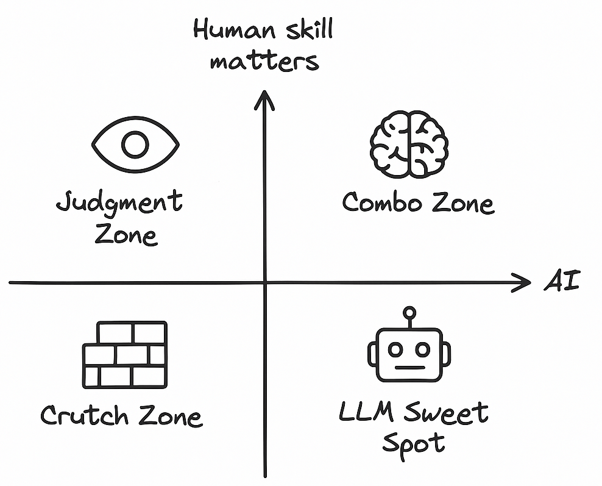

+++
title = "The era of agents - AI vs Humans"
slug = "ai-vs-humans-quadrant"
date = 2025-06-21T00:00:00+05:30
description = "A quadrant model to think about where AI should lead, where humans still shine, and when the combo works best."
draft = true
+++

In my org, I am responsible for using AI on two major fronts:

- To solve customer issues at scale  
- To improve org productivity, especially for engineers

Both are exciting and high-leverage areas — but the bar, expectations, and constraints differ wildly.

For customers, the tolerance for error is low. We can’t afford to mess things up. Every touchpoint matters — understanding their language, reducing back and forth, empathising with their stress. The customer usually reaches out after they’ve tried everything else. It’s not enough to be correct — we have to help solve their problem.

For internal tooling (especially for engineers), we have more room to experiment and take risks. Developers are usually more forgiving if something fails gracefully, and the payoff for successful automation is massive. We’re aiming to 10x workflows, not just patch over gaps.

Now, whether it’s external or internal, I started thinking: maybe the issue isn’t just about whether AI is “good enough”. Maybe it’s about understanding *where* AI should lead, where humans still shine, and when the combo works best.

So I drew this quadrant to make sense of the landscape.

On the X-axis, you’ve got how well AI can handle the problem. On the Y-axis, you’ve got how well humans still do. This isn’t just about customer support — it applies to all kinds of AI use cases: Cursor, Copilot, ChatGPT, you name it.

### Quadrant 4: Pure Automation, Should’ve Been a Feature

Let’s start at the bottom.

This is where humans were in the loop *only* because the product didn’t support something directly. Think rule engines, deterministic workflows, status updates.

These problems don’t need AI. They need product fixes.

- "Resend OTP" — should be a button  
- "Why is my email not verified?" — validation logic  
- "Send alert if threshold breached" — config  

AI sometimes fills this gap, but it's a crutch. It shouldn’t have to.

### Quadrant 1: AI-first, Low-Stakes Tasks

These are classic LLM-friendly problems. There’s a clear set of data or logic. You can build RAG pipelines, plug into tools, and trust the answer most of the time.

- "Where’s my order?"  
- "I am not happy - issue a refund"  
- "How do I update billing info?"  
- "What does this dashboard metric mean?"  

Small errors here don’t break the world. The AI gets it right often enough. And even when it doesn’t, users usually forgive.

Internally, this is also where a lot of AI-assisted productivity happens — suggesting tests, cleaning up stale configs, renaming files, writing boilerplate. These are low-risk, high-reward.

Here are some more examples we’ve seen work well:

- Auto-generating PR descriptions based on code diffs  
- Writing quick integration tests from function signatures  
- Creating GitHub issues or documentation stubs from internal Slack threads  
- Parsing CI/CD logs and summarizing what went wrong  
- Suggesting variable or function names aligned with repo conventions  

The key is: the problem has known structure, AI doesn’t need much context, and mistakes are cheap to fix.

### Quadrant 2: AI + Human is the Real Multiplier

This is the magic quadrant. AI does the grunt work, human makes the final call. With the right tools, a human can 10x their impact:

- A support agent becomes capable of resolving deeper technical issues  
- A dev ships faster by offloading boilerplate and tests  
- A smart intern can jump into fixing complex production issues  

These aren’t just "copilots" — they’re amplifiers. The combo wins.

Especially internally, this is where the biggest org productivity jumps can come from. But even on the customer side, we’re seeing signs — tools that make humans better, not just cheaper.

### Quadrant 3: Human Judgment Still Matters

This quadrant is counterintuitive. You’d think everything eventually moves toward AI, right?

But there are still cases where humans outperform — not because the task is complex, but because the *context* or *emotion* isn’t obvious.

- A user has asked a simple question but is frustrated from past unresolved tickets  
- A dispute needs context across teams, people, and old decisions  
- A hotfix needs coordination and judgment under pressure  

Even if the AI gives the right answer, it might escalate things further. The issue isn’t *what* is said, but *how and when* it’s said.

### The hard truth

Most problems feel like they should sit in Q1 or Q2 — but end up in Q3 due to missing context.  
Imagine a customer asking a straightforward question, but their past tickets haven’t been resolved. They’ve had to repeat themselves multiple times. The AI answers correctly — but it feels like a dead end.  
If that context were available, the same problem could’ve easily been handled in one of the other quadrants.

Context can shift a problem across quadrants.

### So what's the verdict?

I think we’ve still got a year or two where humans play a critical role — helping make AI agents smarter and faster.  
There’s no doubt we’re heading toward an AI-first future. It’s better to accept that and start adapting now.  
I keep asking engineers on my team: *Are you writing code, or are you writing code that can write code?*

This quadrant helped me — and my teams — decide where to push harder, where to let go, and where to slow down and reframe the problem.

Some problems need better prompts. Some need better context. Some just need a human who knows when to say, "I get it. Let's fix this."

Whether you’re building for customers or for your own teams, maybe this framing helps you locate your problem — and more importantly, your leverage.
