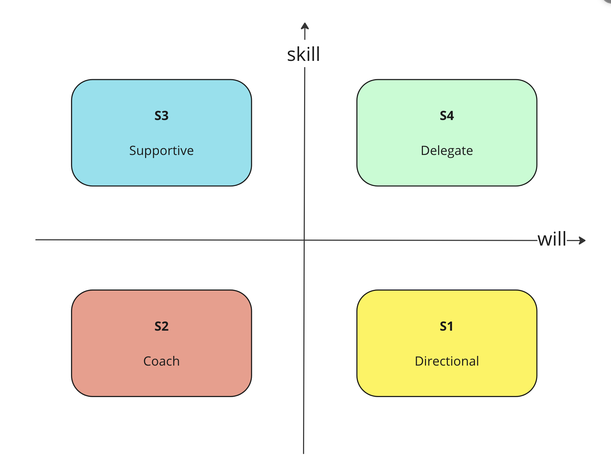

+++
title = 'Situational Leadership'
date = 2024-06-09T14:40:51+05:30
draft = false
+++

I am skeptical of frameworks that prescribe a one-size-fits-all approach to executing a role. Most leadership literature focuses on how to be a good boss, but seldom addresses how to effectively help your team achieve their best. As engineering leaders responsible for a diverse team of super-smart engineers, we need to tailor our approach to each team member's abilities and personalities.

I recently attended a leadership workshop on ["Situational Leadership"](https://situational.com/situational-leadership) which made good sense. The idea is to indentify what stage of performance and maturity one's team-members fit into and accordingly play a different role to help them succeed. The official docs are all fancy so I try to simplify this per my understanding.

A good leader knows when to wear different hats - manager / coach / peer / enabler. Most managers micro-manage when they should be empowering someone or delegating when they should be giving directions. This frameowrk gives a mental model on how to think about this.

First step is to draw a `skill vs will` matrix and identify which quadrant your team-members belong to. **Skill** refers to core-competency expected at one's current role. **Will** refers to a broad range of things - willing to be a team player, excitement to take up new challenges, confidence on owning large projects etc

**S1**: High-will but low-skill. These team members are typically freshers or individuals who have recently changed roles. They are enthusiastic about their new job and eager to learn. They need **DIRECTION** and sometimes even hand-holding until they can figure things out on their own.

**S2**: Low-skill and low-will. These are your laggards. Be a **COACH** to them. A good coach pushes hard but also understands their limits. After a few cycles of feedback, you should evaluate if they are dragging the team down and if it is worth retaining them.

**S3**: High-skill but low-will. These team members get things done and have potential, but they are not challenging themselves to go above and beyond. Sometimes, it may be due to a lack of exposure, and with the right opportunities, they can rise to the challenge. They need your **SUPPORT** and guidance. With the right motivation and alignment, they can push forward.

**S4**: High-skill and high-will. These are your high performers and innovators. They not only get things done creatively but also identify new challenges for the team to tackle. You should **DELEGATE** some of your core/team responsibilities to them, giving them the opportunity to grow to the next level. These are the ones who create bandwidth for you to operate more strategically.

**Side note**: it's a healthy sign if an individual is going from one segment to another. It indicates that they are growing and taking up new challenges. On the contrary if someone is sitting in segment for too long, then that is something for the manager and the org to introspect about.