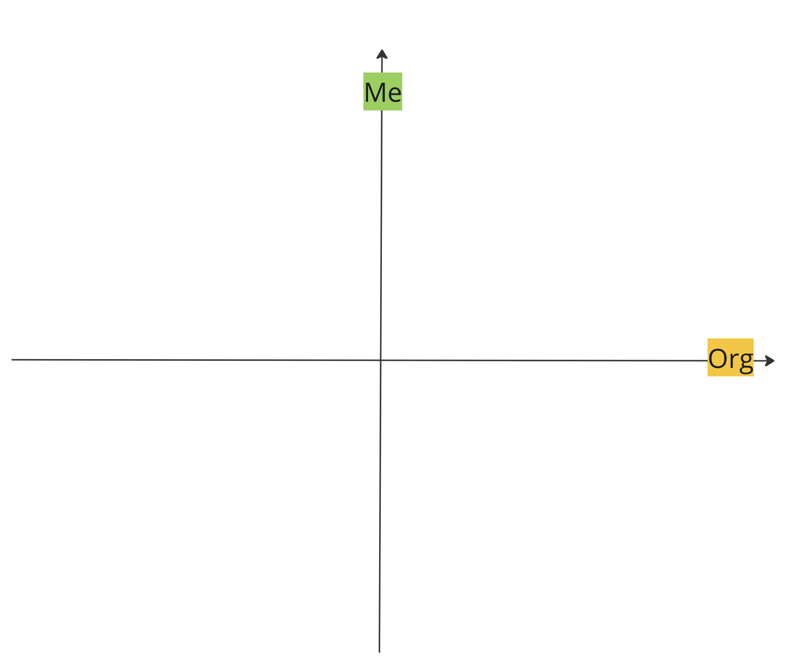
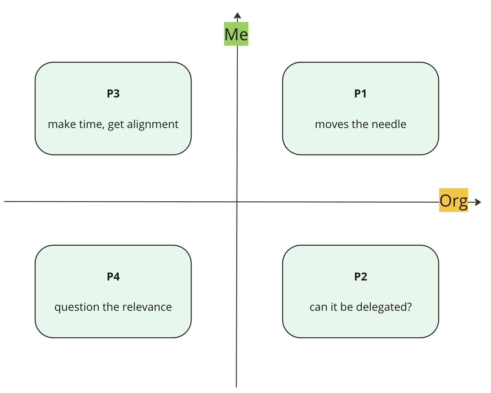

+++
title = 'Debugging Distractions'
date = 2024-05-05T12:10:09+05:30
draft = false
+++

We all struggle with managing time. We want to do 100 different things, but we have only so many hours every day. At work, most of our hours are governed by stakeholders and teammates. This is typical for most of us working in a product-engineering org.

An ideal day is when you work 100% on what you planned to achieve. But the reality is so much different.
- Propose a new idea for that feature
- Review the doc shared on Slack
- Read the interesting article
- Help out a new teammate get onboarded
- Learn that new tool and play around with it
- Handle escalations from stakeholders
- Prepare for leadership connects
- Think of ways to improve the team's productivity

The longer someone has been part of a team, the larger their laundry list becomes, and the more overwhelming it gets. There are so many random things which you need to get involved in whether you like or not. Morever, it is common knowledge that people who take the ownership of things beyond what is expected out of them, and add more value to their customers, are the ones who see faster growth in their careers. 

So it is vital that we protect our time and focus on things that truly matter. Managing time is all about figuring out priorities. The question is how? The first advice everyone gives is to figure out [Urgent vs Important tasks](https://www.eisenhower.me/eisenhower-matrix/) - delegate more and schedule time for the ones you want to focus on. But it gets hard to properly adopt this framework unless you have a lot of autonomy with what you do. 

## My Mental Model - The Zone of Genius

This is the framework that I have been using for the last year. I first came across this term in a tweet (the concept comes from a [book](https://www.amazon.in/Genius-Zone-Breakthrough-Negative-Creativity/dp/1250246547))



I particulary like this line **Your Zone of Genius is where your interests, passions and skills align**. The idea is that you play to your strengths while you work to unlock your next set of skills. 

## Executing the plan

First step is to figure out my levers - it could be anything:
- `my interest` vs `my competence`
- `my goals` vs `team goals`
- `my learning` vs `team's outcome`
- `my sphere of influence` vs `impact for the org`

For simplicity's sake, I have plotted it as `me` *(everything that I want to do)* vs `org` *(everything that is expected out me)*

Next, I try to plot all my tasks against this matrix. I get something like this

- P1: Things that I am accountable for and things that will move the needle - I try my best to accomplish these
- P2: Important but may need not require my involvement all the time. I try to leverage my influence and see if it can be done without me spending too much time
- P3: This is important for my own growth and for long-term progress. I need to make time for it. If I am stretched too thin then I try to work with my manager and peers to get their buy-in (time, L&D budget, dedicated slots etc)
- P4: Ignore, question why does it even need any attention

**Note**: Daily planning rarely works. I always try to plan in weeks or sometimes in months whenever possible

I try to re-assess the overall strategy from a fresh lens whenever I change teams or take up new roles. I try to apply this mental model every Monday morning. There are weeks when things don't go to plan, but that's okay. As the saying goes, 'Plans are nothing; planning is everything.'